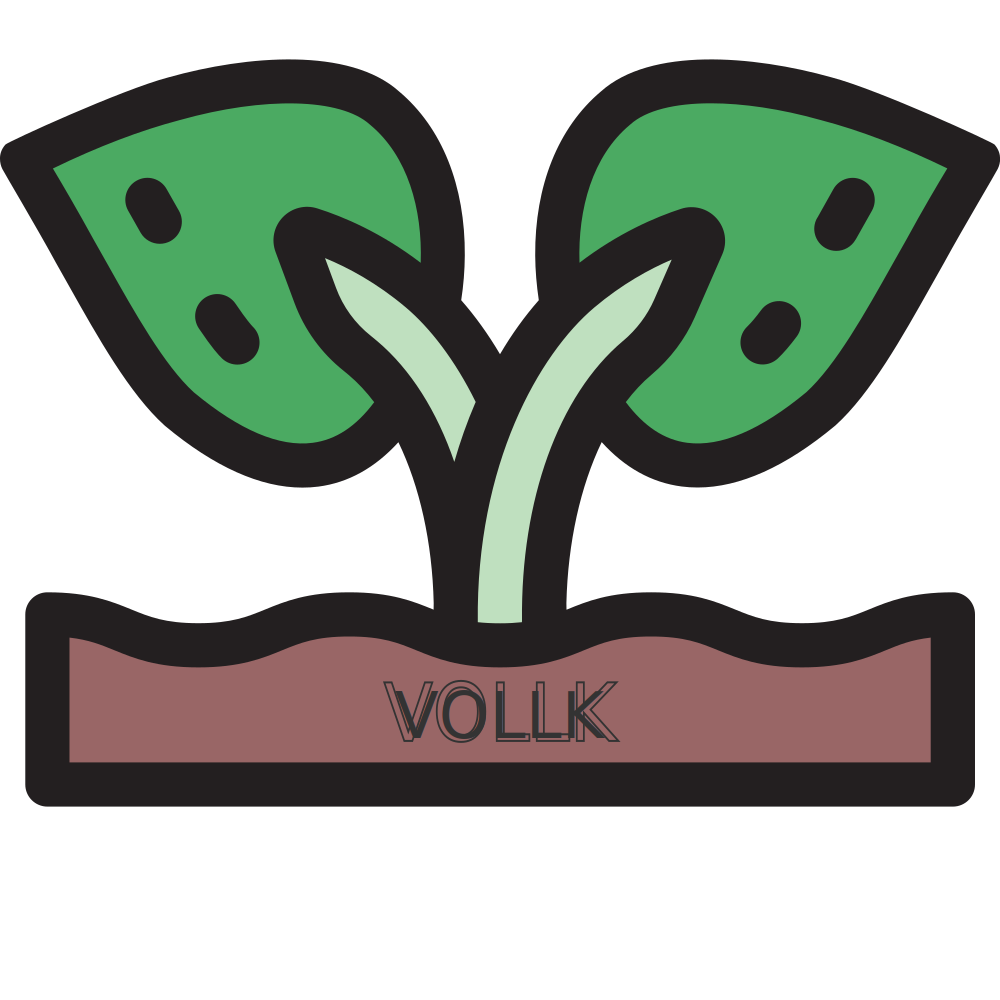

# `Vollk`.js

## 

### This is a command line tool built for [Knex](http://knexjs.org).js for seeding massive amount of fake data into multiple databases

## Table of topics
1. [Documentation](#documentation)
2. [How to install it?](#installation)
3. [Basic configuration](#configuration)
4. [Run and see](#run_and_see_the_magic)
5. [List of commands](#list_of_commands)
6. [Database connections](#database_connections)
6. [Be a contributor](#contributing)
6. [New versions of this tool](#changelog)
6. [Licence](#licence)
6. [Further help](#further_help)

## Documentation

This tool integrates the [inquirer](https://www.npmjs.com/package/inquirer).js library for making more interactive the commands built in [commander](https://www.npmjs.com/package/commander).js. Also this tool incorporates [faker](https://www.npmjs.com/package/faker).js for generating massive amounts of fake data.

## Installation

### For development

> #### `git clone https://github.com/renerpdev/vollk.git vollk`
> #### `npm install`
> #### `npm link`

### For production

> #### `npm install -g vollk`

## Configuration

Before run it you need to create an `.env` file in your relative path. There are multiples ways to do that:

* Copying the code from [here](.env.example)
* Renaming file `.env.example` to `.env` inside this project.
* Running the command `vollk env`

Finally you need to fill this `ENV` variables with theirs respective values.

**[note]:** If there is not `.env` file in your relative path, then default values will be set:

+ `MODE:` **development**
    - `DB_CLIENT:` mysql 
    - `DB_NAME:` vollk 
    - `DB_HOST:` localhost 
    - `DB_USER:` root 
    - `DB_PASS:` _[none]_ 

or...

+ `MODE:` **production**
    - `DB_CLIENT:` pg 
    - `DB_URL:` _[none]_ 
    
or...

+ `MODE:` **local**
    - `DB_CLIENT:` sqlite3
    - `SQLITE_PATH:` db.sqlite 

## Run and see the magic

> ### `vollk` list

## List of commands

1. `list` (Lists all options)

2. `seed` (Seeds the database with yours especs)

3. `create` (Creates a seed file)

4. `run` (Runs the last seed file)

4. `env` (Creates an empty .env file)

### Some options for this commands

* `--version`
* `--help`

## Database connections

To integrate this tool with other database connections you need to install the appropriate package: (by default only supports **`mysql`**, **`pg`**)

* `npm install` mysql2
* `npm install` mariasql
* `npm install` strong-oracle
* `npm install` oracle
* `npm install` mssql
* `npm install` sqlite3

## Contributing

All the unit tests are written with [Jasmine](https://www.npmjs.com/package/jasmine). Feel free to add more functionalities and bug fixes but also add a test for each of them. Just type `npm test`, but before that you need to install globally `Jasmine`

> `npm install -g jasmine`

## Changelog

Get update with all new versions [here](https://github.com/renerpdev/vollk/releases)

## Licence
Copyright (c) 2018 Rene Ricardo. Licensed under the MIT license.

## Further help

Send me an [email](mailto:renerp2016@gmail.com) or a [tweet](https://twitter.com/renerpdev) if you have some doubt or just add an [issue](https://github.com/renerpdev/vollk/issues)